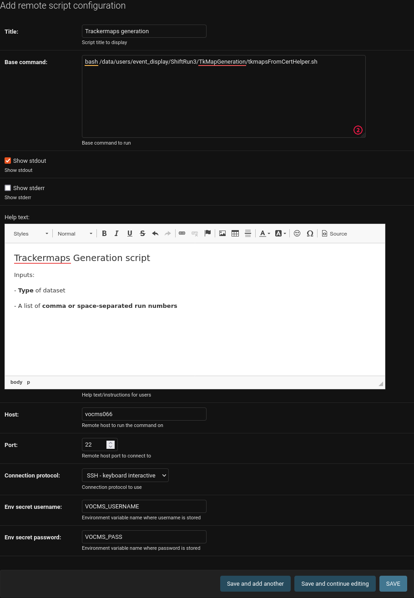
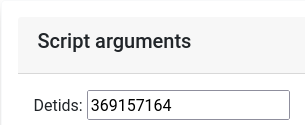

Administration manual
=====================

The administrator has the most power in the website. He can create new
(local) users and is responsible for maintaining the website. He can
update or create the OAuth2 keys, which are necessary for CERN Single
sign-on.

The admin panel of the administrator consists of all of the same rights
that a shift leader has plus additional settings that for site
management.

.. note::
   
   You must be an Administrator in order to follow the procedures listed here

Roles
-----
To assign the Shifter or Shift Leader role to a user, follow the steps below:

#. Make sure that the user has already signed in using the **Login with CERN** button.
#. Navigate to the users administration page
     .. image:: images/admin-link.png   
#. Click on the **Users** link
     .. image:: images/admin-users.png
#. Search for the user you want to assign the role to and click on their username:
     .. image:: images/admin-user-to-assign.png
#. Under **User privilege**, select the appropriate role:
     .. image:: images/admin-change-role-shifter.png
#. Click on **SAVE**
	  
	   	   
Adding/Tweaking Checklist items
-------------------------------
Checklists appear on the `/update/` url of the app, and their purpose is to help
the Shifter keep track of the required checks that must be done before submission.

These can be configured from the admin panel.

**Checklists** are composed of **Checklist Groups**. Checklist Groups, are composed
of **Checklist Items**. So, if you need to add items to a specific Checklist, create
new Checklist Items and select the appropriate Checklist Group they should belong
to. 

An example of a checklist structure:

.. graphviz::
   
   digraph checklists {
   "Checklist Item" [color = green, shape = square, fixedsize=true, width=1.5]
   "Checklist Group" [color = blue, shape = square, fixedsize=true, width=1.5]
   "Checklist" [color = red, shape = square, fixedsize=true, width=1.5]

   "Checklist Item" -> "Checklist Group" [style=invis]
   "Checklist Group" -> "Checklist" [style=invis]   
   
   "Tracking" [color = red]
   "Bad components" [color = blue]
   "Tracking checks" [color = blue]
   "Check TkMaps" [color = green]
   "did we recover some 'known' bad component?" [color = green]
   "If yes, what is the reason to be flagged as bad?" [color = green]
   
   "did we recover some 'known' bad component?" -> "Bad components"
   "If yes, what is the reason to be flagged as bad?" -> "Bad components"   
   "Check TkMaps" -> "Tracking checks"
   "Bad components" -> "Tracking"
   "Tracking checks" -> "Tracking"
   }

   
Adding Remote scripts
---------------------

Custom remote scripts can be added to CertHelper from the admin interface.
Those scripts can reside in (virtually) any remote machine, assuming CertHelper
has been configured properly to access it.

In a nutshell, CertHelper provides a GUI wrapper for configuring and executing
remote `bash` scripts and fetching and displaying generated files.

Requirements for adding a new remote script:

1. Have the required **access rights** to the remote machine (e.g. username and password)
   and have them loaded in CertHelper (see.: `Adding secrets to CertHelper`_).
2. The remote script's **absolute path**.
3. The expected **paths** and **filenames** (in the form of a regular expression) of the
   generated output files.

For each new script that is added, a new automatically-generated page will also be created
with the required inputs as a form, and HTML elements to display the expected outputs.

Create a new :guilabel:`Remote script configuration`
^^^^^^^^^^^^^^^^^^^^^^^^^^^^^^^^^^^^^^^^^^^^^^^^^^^^

Click `here <http://certhelper.web.cern.ch/admin/remotescripts/remotescriptconfiguration/add/>`__
to add a new configuration for the script to run.

Give it a :guilabel:`Title` to distinguish it from other scripts, e.g. "Trackermaps generation".

Enter the :guilabel:`Base command` which is the command to run on the remote machine, e.g. "bash /data/users/event_display/ShiftRun3/TkMapGeneration/tkmapsFromCertHelper.sh".

Enter the :guilabel:`Host` to run the command on (e.g. "vocms066"), :guilabel:`Connection protocol`
and :guilabel:`Port` to use to connect to it (e.g. "SSH - Keyboard interactive" and "22" for ``ssh``).

Then, if connecting with Username & password, provide the **names of the CertHelper secrets you
created previously** (not the actual values of the username and password!!!) under the
:guilabel:`Env secret username` and :guilabel:`Env secret password` fields
(e.g. "VOCMS_USERNAME" and "VOCMS_PASSWORD").

Click on :guilabel:`SAVE`.

The final configuration might look like this:

Add arguments to the remote script
^^^^^^^^^^^^^^^^^^^^^^^^^^^^^^^^^^
Now that the script has been created, you will probably need to run it with one or more **arguments**.
These can either be **positional** or **keyword**.

Each argument added to a specific remote script will add a new field in the form generated
to get the inputs required from the users to run the script. For example:

Add a positional argument
"""""""""""""""""""""""""
Click `here <https://certhelper.web.cern.ch/admin/remotescripts/scriptpositionalargument/add/>`__
to add a new positional argument.

A :guilabel:`Name`, :guilabel:`Type` (e.g. integer or string), :guilabel:`Position`
and :guilabel:`Mother script` must be specified.

The :guilabel:`Type` specifies the type of input that will be displayed in the form
generated and the type checks that will be done.

The :guilabel:`Mother script` defines the script this argument belongs to.

Add a keyword argument
""""""""""""""""""""""
Click `here <https://certhelper.web.cern.ch/admin/remotescripts/scriptkeywordargument/add/>`__
to add a new keyword argument.

A :guilabel:`Name`, :guilabel:`Type` (e.g. integer or string), :guilabel:`Position`
and :guilabel:`Mother script` must be specified.

The :guilabel:`Type` specifies the type of input that will be displayed in the form
generated and the type checks that will be done.

The :guilabel:`Mother script` defines the script this argument belongs to.

Add expected output files to the remote script
^^^^^^^^^^^^^^^^^^^^^^^^^^^^^^^^^^^^^^^^^^^^^^
If you expect the remote script to generate an output file that you
want to fetch and make available to the user, you can add the required
configuration to do so `here
<https://certhelper.web.cern.ch/admin/remotescripts/scriptoutputfile/add/>`__.

You will need to specify the :guilabel:`Directory` in the remote machine where
the file is expected to be found after the script execution and the
:guilabel:`Filename regex` of the filename.

Filename validation
"""""""""""""""""""

It's possible that you will need to do some extra validation of the filename
generated if, for example, the output filename contains some or all of the inputs
specified by the script.

For example, the **Single module occupancy plotter** takes as inputs:

- Positional argument 1: Datataking period
- Positional argument 2: Reconstruction type
- Positional argument 3: Run number
- Positional argument 4: Module list

The generated file is in the form
``<Reconstruction type>_<words>__<words>_<words>_<words>_<Run number>.png``
For this case, we want to validate that the output file contains the **Reconstruction
type** (positional argument 2) and the **Run number** (positional argument 3) in the filename.
To validate the filename, you will need to specify the regex as
``(?P<arg2>\w+)_(\w+)__(\w+)__(\w+)_(\w+)_(?P<arg3>\d+).png``, where ``arg2`` is considered
a special keyword (regex named capture group) that represents **Positional argument 2**, and
``arg3`` represents **Positional argument 3**, respectively.

		  
Addendum
--------

Adding secrets to CertHelper
^^^^^^^^^^^^^^^^^^^^^^^^^^^^

.. warning::

   Secrets should **not** be stored in plaintext. Ever. Make sure
   you follow the directions below.

Secrets, in this context, are variables loaded by Django at runtime using
`python-decouple<https://pypi.org/project/python-decouple/>`__
and they should not be publicly available.

To prevent them being stored in a plain-text file like ``settings.py``, they are
loaded as **environmental variables**, which are either found in an ``.env`` file
or created at runtime from the operating system: since we deploy on CERN's
PaaS platform, environmental variables are created per-build. For example, for
CertHelper, they are created `here
<https://paas.cern.ch/k8s/ns/certhelper/buildconfigs/certification-helper/environment>`__.

To create a new secret, follow the steps below:

1. Add a new project :guilabel:`Key/value secret` for CertHelper `here
   <https://paas.cern.ch/k8s/ns/certhelper/secrets>`__.
   Give the secret and the secret variable a distinguishable name, e.g.
   ``vocms-secrets`` and ``username`` respectively.
   
2. Add a new build environmental variable `here
   <https://paas.cern.ch/k8s/ns/certhelper/buildconfigs/certification-helper/environment>`__
   by clicking on the :guilabel:`Add from ConfigMap or Secret`, selecting the
   name of the secret you created on the previous step (e.g. ``vocms-secrets``) and
   the key of the secret you want to use (e.g. ``username``).
   Give the new environmental variable a meaningful name, e.g. ``VOCMS_USERNAME``.
   The secret is now ready to be used.
   
3. You will have to rebuild the project now. See :doc:`deployment`.
   The secret is now safely available in CertHelper.

			 
