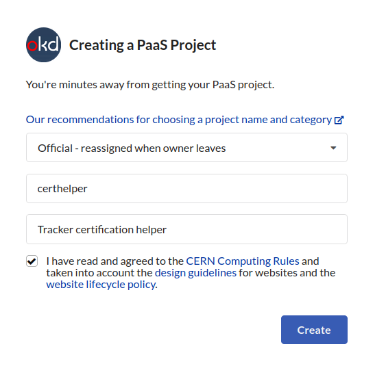

Deployment
==========

Requesting a website
--------------------

Create a new PaaS project: https://paas.docs.cern.ch/1._Getting_Started/1-create-paas-project/

When creating a website a lot of different site types can be chosen. In
order to use the OpenShift software, the "PaaS Web Application" option
has to be selected. About 15 minutes after the website has been
requested it is ready to use.

OpenShift
---------
The following steps will guide you through the deployment procedure of the app on OpenShift.
An overview of the steps is:
* Create a new PaaS project
* Setup the repository that will be used
* Configure environmental variables
* Mount the EOS drive

Setup
~~~~~

Prerequisites
^^^^^^^^^^^^^

Download the ``oc`` command line utility, preferably on your lxplus account.

https://paas.docs.cern.ch/1._Getting_Started/5-installing-cli/

Setup Procedure
^^^^^^^^^^^^^^^

Once the website is successfully requested the application should be
available in OpenShift. Following steps need to be done in order to
configure the web application with the GitHub repository:

1.  Go to https://paas.cern.ch
2.  Select the project you created
	.. image:: images/paas-select-project.png
3.  Click on "Add" on the left
	.. image:: images/paas-add.png	
4.  choose ``Git Repository``
	.. image:: images/paas-add-git.png
5.  Paste the repository URL in the field provided.
6.  Under ``Advanced Git options``, you may select a specific branch, if needed.
7.  okd will automatically detect that this is a Python	application and will select the latest version of Python.
	.. note::
	   As of writing, we select ``3.8-ubi8``.
	   
8.  Under **General**, change the **Application name** and **Name** appropriately. 
9.  Under **Resources**, select **Deployment**
	.. image:: images/paas-deployment.png
			   
10. Add GitHub credentials at "Source Secret" if the repository is
    private
	
11. Make sure that *Create a route to the Application* is ticked.
12. Under *Show advanced Routing options*:
	a. Paste the **Hostname** you want (will be automatically registered),
	b. Make sure *Secure Route* is ticked,
	c. Under **TLS termination**, select *Edge*,
	d. Under **Insecure Traffic**, select *Redirect*.
13. Click on **Create**. The application has been configured!
	.. note::
	   Under **Topology**, you will see your project trying to run for the first time.
	   This will fail, since most environmental variables are missing. Click on the
	   main app:
	   
	   .. image:: images/paas-topology-main-app.png

	   You should be getting the following error:
				  
	   .. image:: images/paas-crash-loop.png
	
..
   14. click on your name in the top right corner and click on ``Copy Login Command`` and login in your terminal by pasting it.
..
   14. select the Project

	   .. code:: bash

				 $ oc project <your-project-name>

   18. create Secrets

   First you have to create the secrets in Openshift for all accounts needed below:

   .. code:: bash

	  $ oc create secret generic <secret-name> --type=kubernetes.io/basic-auth --from-literal=username=<account-username> --from-literal=password=<account-password>

14. Under :menuselection:`Builds --> Your project name --> Environment` use the :guilabel:`Add more` and :guilabel:`Add from ConfigMap or Secret` buttons to add the variables:

	* Accounts/Secrets environment variables (added using :guilabel:`Add Value from Config Map or Secret` button):

	  - Database credentials:
		::
		   
		   DJANGO_SECRET_KEY          <your-secret>
		   DJANGO_DATABASE_USER       <your-username>
		   DJANGO_DATABASE_PASSWORD   <your-password>

	  - Email notifications:
		::
	   
		   DJANGO_EMAIL_HOST_USER     <your-email-username>
		   DJANGO_EMAIL_HOST_PASSWORD <your-email-password>

	  - Tracker Maps credentials:
		::
		 
		   DJANGO_SECRET_ACC           <account-username>
		   DJANGO_SECRET_PASS          <account-password>

	* Remaining Variables (added using :guilabel:`Add Value` button):

	  - Needed for OpenShift to be able to access the site:
		::
		 
		   DJANGO_ALLOWED_HOSTS       <Host website you registered in step 12.a>
		   DJANGO_DEBUG               False
		   
	  - this will be used for the database credentials:
		::
			 
		   DJANGO_DATABASE_ENGINE     django.db.backends.postgresql_psycopg2
		   DJANGO_DATABASE_NAME       <your-database-name>
		   DJANGO_DATABASE_HOST       <your-database-host>
		   DJANGO_DATABASE_PORT       6611

	  - this will be used for the email notifications:
		::
			 
		   DJANGO_EMAIL_HOST          smtp.cern.ch
		   DJANGO_EMAIL_PORT          587
		   DJANGO_EMAIL_USE_TLS       True
		   DJANGO_SERVER_EMAIL        <tkdqmdoctor-email-address>

	  - this will be used for the cernrequest and Runregistry API:
		::
			 
		   CERN_CERTIFICATE_PATH       <path>
	  
	  - this will be used to access the Redis server (secret is created automatically by the redis yaml):
		::

		   REDIS_HOST                  <redis-[server number]>
		   REDIS_PASSWORD              <password>

	  - Other:
		::
		  
		   CSRF_TRUSTED_ORIGINS        https://[the hostname you resistered in step 12.a]
15. Save the variables and rebuild the project:
	.. image:: images/paas-rebuild.png

	You should now be able to visit the app on the URL you specified.
		
.. note::
   The procedure above should only be followed once. Once the app is fully configured, you should not have to alter anything, unless a change occurs (e.g. Database host/password).

Mount EOS Storage
~~~~~~~~~~~~~~~~~
.. warning:: Might be deprecated

The project has 1 TB of storage associated in the EOS. To mount it to
OpenShift follow these instructions.

Detailed instructions can be found at
https://cern.service-now.com/service-portal/article.do?n=KB0005259

Create Secret
^^^^^^^^^^^^^
.. warning:: Might be deprecated
			 
Replace with your password.

.. code:: bash

   oc create secret generic eos-credentials --type=eos.cern.ch/credentials --from-literal=keytab-user=tkdqmdoc --from-literal=keytab-pwd=<the-password>

Do EOS stuff
^^^^^^^^^^^^
.. warning:: Might be deprecated

Run these commands and replace with the name of your build.

.. code:: bash

   oc set volume dc/<your-build-name> --add --name=eos --type=persistentVolumeClaim --mount-path=/eos --claim-name=eos-volume --claim-class=eos --claim-size=1

   oc patch dc/<your-build-name> -p "$(curl --silent https://gitlab.cern.ch/paas-tools/eosclient-openshift/raw/master/eosclient-container-patch.json)"

   oc set probe dc/<your-build-name> --liveness --initial-delay-seconds=30 -- stat /eos/project/t/tkdqmdoc

   oc set probe dc/<your-build-name> --readiness -- stat /eos/project/t/tkdqmdoc

if it gets stuck or you encouter some errors on openshift like

``Readiness probe failed: stat: cannot stat '/eos/project/t/tkdqmdoc': No such file or directory``

then rerun all 4 commands again:

.. code:: bash

   oc set volume dc/<your-build-name> --add --name=eos --type=persistentVolumeClaim --mount-path=/eos --claim-name=eos-volume --claim-class=eos --claim-size=1

   oc patch dc/<your-build-name> -p "$(curl --silent https://gitlab.cern.ch/paas-tools/eosclient-openshift/raw/master/eosclient-container-patch.json)"

   oc set probe dc/<your-build-name> --liveness --initial-delay-seconds=30 -- stat /eos/project/t/tkdqmdoc

   oc set probe dc/<your-build-name> --readiness -- stat /eos/project/t/tkdqmdoc

Then start the built and it should work.

Tip: for deleting the volume run the following command first

.. code:: bash

    kubectl patch pvc PVC_NAME -p '{"metadata":{"finalizers": []}}' --type=merge

Add shared volume
~~~~~~~~~~~~~~~~~
.. warning:: Might be deprecated

Add a shared volume to allow the use of unix socket between nginx and daphne

.. code:: bash

    oc set volume dc/<your-build-name> --add --name=<volume-name> --type=persistentVolumeClaim --mount-path=<path> --claim-name=<volume-name> --claim-class=cephfs-no-backup --claim-size=1

Add REDIS Server
~~~~~~~~~~~~~~~~~

Download the ``helm`` command line utility.

https://github.com/helm/helm

On Arch Linux all you have to do is install ``kubernetes-helm-bin`` from
the AUR.

.. code:: bash

   yay -S aur/kubernetes-helm-bin

And then just run the following commands in the same terminal where you have logged in previously:

.. code:: bash

   helm install redis stable/redis --set securityContext.runAsUser=<username-id> --set securityContext.fsGroup=<username-id>

The username-id can be found by going to Application->Pods-><Your Project>->Terminal and then running the ``whoami`` command which will return an id like ``1008250000``

Install

Add NGINX Server (not working for now)
~~~~~~~~~~~~~~~~~~~~~~~~~~~~~~~~~~~~~~

1.  go to https://openshift.cern.ch/console/
2.  choose "Nginx HTTP server and a reverse proxy (nginx)"
3.  click "Next"
4.  select your project in "*Add to Project*"
5.  choose a name
6.  add the git repository: https://github.com/alingrig/nginx-ex
7.  click "Create"
8.  add the shared volume

.. code:: bash

    oc set volume dc/<your-chosen-name> --add --name=<volume-name> --type=persistentVolumeClaim --mount-path=<path> --claim-name=<volume-name> --claim-class=cephfs-no-backup --claim-size=1

9.  go to Application->Routes
10. replace the dev-certhelper route with an one for nginx-server

Deployment
~~~~~~~~~~

Production Site
^^^^^^^^^^^^^^^

If you want to push to the production website (master branch) you have
to manually trigger a build at Openshift
(https://paas.cern.ch/k8s/ns/certhelper/build.openshift.io~v1~BuildConfig). This is due to
safety reasons, to not accidentally trigger a broken build by pushes to
the master branch.

This can be done by visiting
`paas.cern.ch <https://paas.cern.ch/>`__, selecting the
``certhelper`` project and then visiting :menuselection:`Build --> builds`. This
page should already contain a build of the Certification Helper project that is
automatically pulled from GitHub. By clicking on this build and then
pressing the :guilabel:`build` button the whole deployment process should be
started. In the meantime, the logs of the build process can be viewed by
clicking on :guilabel:`View Log`.

Database
--------

The database was requested from the CERN "DB on demand service"
(https://dbod.web.cern.ch/)

After the database has been requested it can be used straight away.
Django takes care of creating the necessary tables and only requires the
credentials.

Single Sign-On
--------------

CERN Setup
~~~~~~~~~~

OAuth2 is an authorization service which can be used to authenticate
CERN users. The advanctage of using such an authorization service is that
users of the certification helper do not have register manually, but can
already use their existing CERN accounts.

In order to integrate the CERN OAuth2 service with the website, the
application has to be registered at the SSO Managment site.
https://sso-management.web.cern.ch/OAuth/RegisterOAuthClient.aspx

When registering a redirect\_uri has to specified which in case of the
certification helper is
``https://certhelper.web.cern.ch/accounts/cern/login/callback/`` for
the production website and
``https://dev-certhelper.web.cern.ch/accounts/cern/login/callback/``
for the development site.

Integration
~~~~~~~~~~~

The single sign-on integration is very easy when using the
*django-allauth* python package, which has build in CERN support.

In order to make use CERN single sign-on service it has to be configured
in the Admin Panel under "Social applications". There the client id and
secret key has to be specified which can be listed in the "cern
sso-managment" website.
