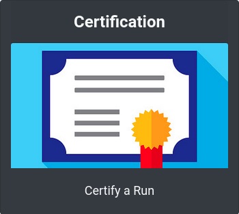
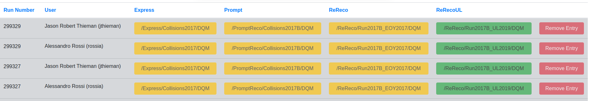
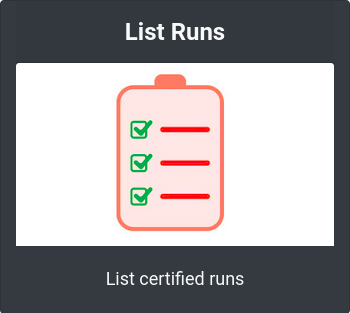
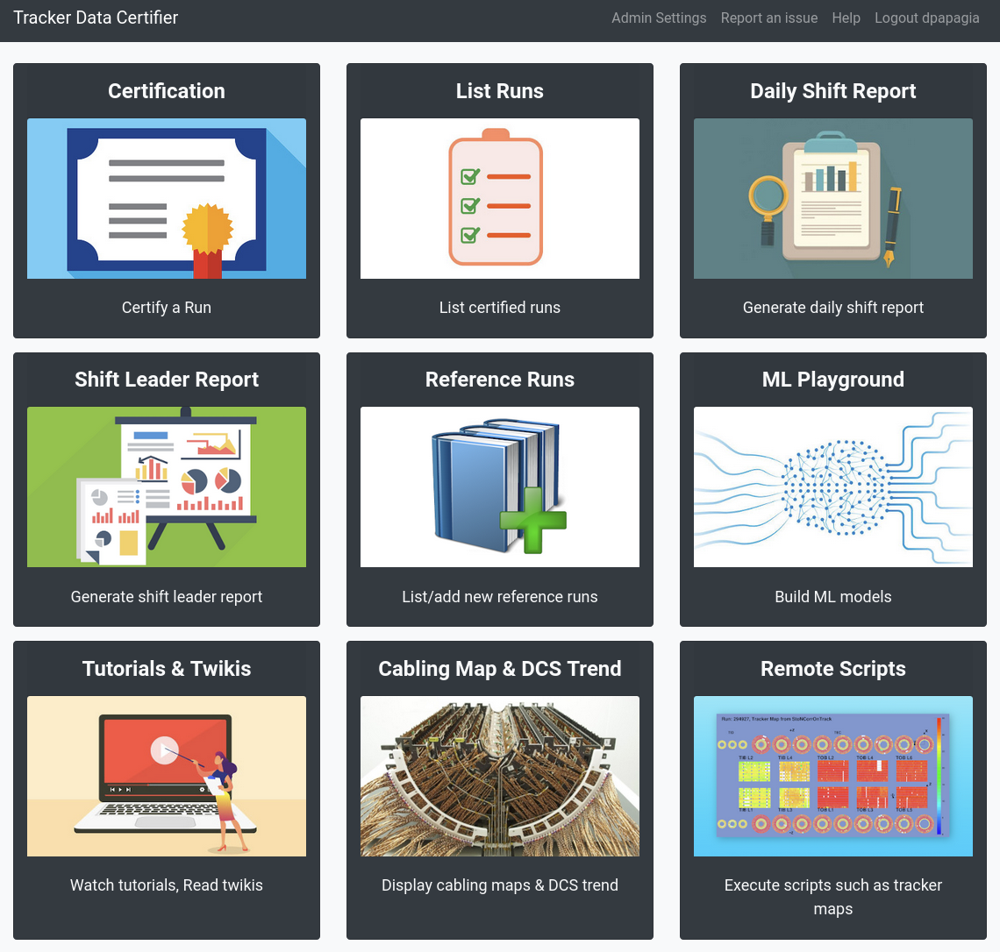
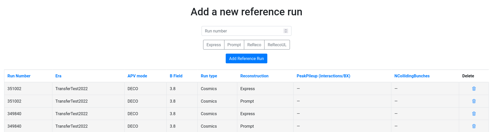
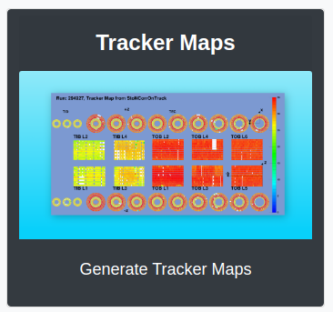
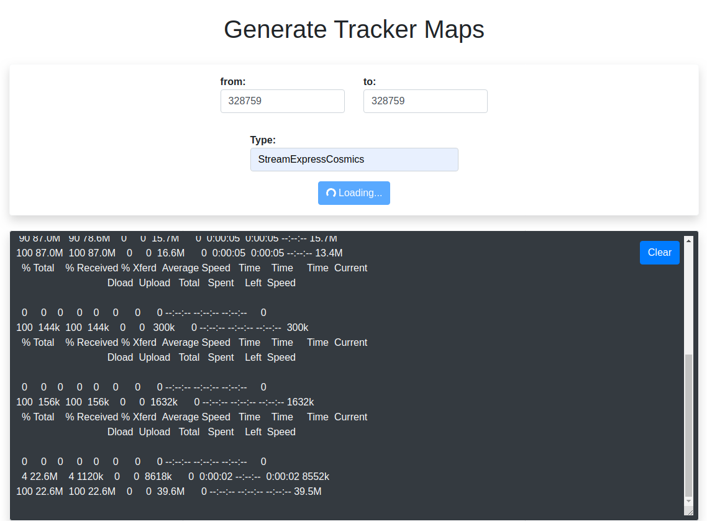

User manual
===========

Roles
-----

The Certhelper distinguishes between 3 different Roles

-  Shifter
-  Shift Leader
-  Admins

Each role has their set of rights which are explained in the following
chapters.

Login
-----

The first thing a user has to do in order to be able to modify data is
to login. The recommended way of logging is using CERN Single
sign-on by clicking on the "Login with CERN" button.

If the user wants to log in with a local account that is only used by
the Certhelper website instead, he can do so by clicking "Use local account instead", entering the
credentials and clicking on "Sign in".

Logging in with CERN updates the user privileges automatically, such
that shift leaders are detected by the e-groups the user is a member of.
The Shift Leader e-group is automatically assigned and does not have to
be updated manually.

Shifter
-------

Certification
~~~~~~~~~~~~~~~~~~~

Adding a new run certification can be done by clicking the accessing the Certification tile button on the main page.

This will open the certification page which contains the first step of the certification process

The purpose of this page is to receive the runs data based on the number and type of run. There are currently two ways to do that:

- **Certify Button**:
  Once you add the run number and the type after which you press the Certify button and go to the certification form page.

- **Get Open Runs**:
  This will return the requested open runs, either by using a list of run numbers or a range of run numbers. This is meant to work in such a way that each shifter will get his open runs at the beginning of the week and go through them one by one afterwards.

\
  Grayed out row means the openrun is taken by somebody else.
  Yellow run type button means run not certified
  Green run type button means run is certified

  The table also gives the user the option to delete an entry from his account(this is completely safe, the run can be retrieved back anytime). Main reason for this is in case a run has to be moved from one user to another, it first has to be removed from the first user and then retrieved back by the second.

Going to the next certification step is done either by pressing the Certify button or one of the run type buttons from the Open Runs table.

The form consists of the following elements:

-  **Run number**
-  **Type**
-  **Type path**
-  **Date**: The date of the certification
-  **Type Section**: Automatically retrieved information about the type of the run
-  **Lumi Section**: Automatically retrieved information about the lumi of the run
-  **Fill Section**: Automatically retrieved information about the fill of the run
-  **Reference Run**: Which Reference Run was used to certify this run?
-  **Checklists**: These need to be covered by the shifter in order to make sure all the steps have been covered in the run certification
-  **Pixel**: Status of the Pixel Component (good/ bad/ excluded/ low
   statistics)
-  **Strip**: Status of the SiStrip Component
-  **Tracking**: Status of the Tracking?
-  **Trackermap**: Does the Trackermap exist or is it missing?
-  **Problem section**: Here are added all the problems that the run might have
-  **Comment**: Extra comments that are worth to mention

Since most of the information is filled automatically the shifter only has a few fields to fill.

Assuming the are no problems with the run the shifter has to fill the Reference Run field, the Tracker Maps filed and the state of the run, in this example good, good and good. Then the only thing left to do is to tick all the checklists and submit. 

The Submit won't let you complete the action if the form is not filled correctly.

Checklists
^^^^^^^^^^

The "Checklists" have to be checked to be
able to submit a new run certification. The checklists consist of
instructions which have to be performed in order to certify the
data correctly. It also includes links with easy access to external
tools that should be used during the data certification process.

A certified run cannot be submitted unless every checkbox is read and
checked. This ensures that no shortcuts are taken and to improve the
quality of certifications.

Once a run is created with the "Submit" button at the bottom of the
form, the run will appear in the list of Certified runs. If the shifter
wants to edit a certified run, he can do so by clicking on the "Edit"
button in the list of certified runs.

List Runs
~~~~~~~~~~~~~~~~~~~
Seeing the certified runs can be done by clicking the List Runs tile button on the main page.

Here the shiftleader or shifter could see all the certified runs he/she has certified.

This page contains a table with all the certified runs that defaults for those certified in the current day and a filter where you can choose different day ranges, run numbers ranges and many more for precisely listing the desired runs.

Daily Shift Report
~~~~~~~~~~~~~~~~~~~

Clicking the Daily Shift Report tile button take you to the shifter report.

Once pressed, a daily shift report is generated automatically and can be used by the shifter.

Shift Leader
------------

Once a shift leader logs in via CERN SSO, the website automatically
detects the shift leader status by the e-groups the user is associated
with. In particular, the current shift leader should always be
automatically assigned to the e-group "cms-tracker-offline-shiftleader".

The user can ensure he has shift leader rights by checking if a "Shift
Leader" or an "Admin Settings" tab appears in the navigation bar.

Apart from that the shiftleader has access to all the pages/tiles, including the shifter ones.

Add Reference Run
~~~~~~~~~~~~~~~~~

A new reference run can be added in the Admin Settings by clicking on the Add Reference Run tile.

Once clicked you are presented with the following page:

Here the user can either delete a reference run that was added by mistake or add a new one by using the run number and type of the run.

!!! Warning !!! Deleting a reference run will delete all the certifications that have used that reference run since the won't have a reference anymore, no longer being valid.

Generate Tracker Maps
~~~~~~~~~~~~~~~~~~~~~

By using the Tracker Maps tile button you can access the page where you can generate tracker maps.

Here the shiftleader can generate tracker maps for a range of runs. All he/she has to do is add the number range and the type. Once that is done on press of the "Generate Tracker Maps" button will start the process. The shiftleader can follow the process by looking at the logs of the generating script.

Shift Leader View
~~~~~~~~~~~~~~~~~

In the shift leader view, a shift leader receives information about all
the certified runs for the current week. The page consists of multiple
tools, which facilitate the shift leader in creating weekly shift leader
reports. This page can be accessed through the Shift Leader Report tile button.

Filter
~~~~~~

At the top of the page, the shift leader can filter the certified runs
by his needs. If no filters were specified, then the current week is
automatically selected.

The runs can be filtered by time, run number, run type, problem
categories or specific shifters. When clicking the "Filter" button, the
whole shift leader page gets updated according to the specified
criteria.

Certified Runs tab
~~~~~~~~~~~~~~~~~~

In the "Certified Runs" tab a tabular list of all the certified runs for
the current week (or specified filter criteria) is shown. The shift
leader has the right to edit the certifications of the shifters or
delete them entirely. It is essential to keep the list of certified runs
correct in order to generate accurate shift leader reports.

Run Registry Comparison tab
~~~~~~~~~~~~~~~~~~~~~~~~~~~

In the "Run Registry Comparison" tab, the shifter can verify that the
runs in the Certification helper match with the entries in the Run
Registry. If any runs differ, they will be listed in this tab. A shift
leader can then edit the runs himself or tell the shifter to update them
accordingly.

Overview tab
~~~~~~~~~~~~

In the "Overview" tab a quick overview of the certified runs can be
seen. It also consists of the list of shifters for that week.

.. image:: images/shiftleader-overview.png

Delete Certifications
~~~~~~~~~~~~~~~~~~~~~

If a run gets deleted by shift leader it can still be restored in the
"Deleted Certifications" tab. If the shift leader wishes he can also
irrevocably delete the certification of the run there.

Summary tab
~~~~~~~~~~~

In the "Summary" tab the shift leader can generate the same kind of
summary report that the shifters submit to the ELOG. It is just a
textual version of all the certifications.

Shift Leader Report tab
~~~~~~~~~~~~~~~~~~~~~~~

The most useful tab for shift leaders is the "Shift leader Report" tab.
It automatically generates slides for the weekly shift leader report.

List of LHC Fills
^^^^^^^^^^^^^^^^^

This page lists all the LHC fills that were part in a certification that
week. The LHC fill number is taken from the Run Registry via the resthub
API.

Weekly Certification
^^^^^^^^^^^^^^^^^^^^

This tab generates the slide called "Weekly certification". It sums up
the number of certified runs for each type and the corresponding
integrated luminosity.

.. image:: images/shiftleader-report-weekly.png

Day by Day
^^^^^^^^^^

The "Day by day" notes give a quick overview for each day of the week.

List of runs
^^^^^^^^^^^^

This page list all the run numbers of runs certified that were certified
that week, grouped by reconstruction type and day. The run numbers are
colored green if the run was certified "Good" and red for "Bad".

Administrator
-------------

The administrator has the most power in the website. He can create new
(local) users and is responsible for maintaining the website. He can
update or create the OAuth2 keys, which are necessary for CERN Single
sign-on.

The admin panel of the administrator consists of all of the same rights
that a shift leader has plus additional settings that for site
management.
